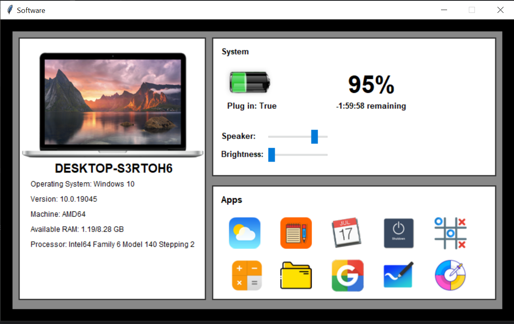
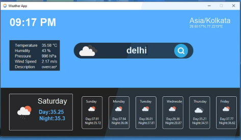
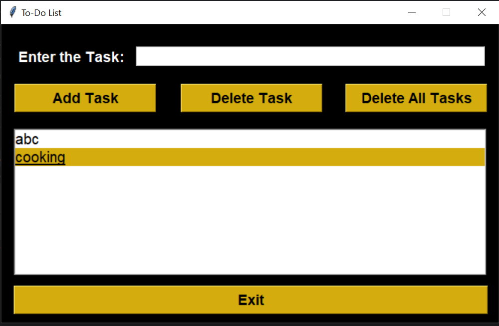
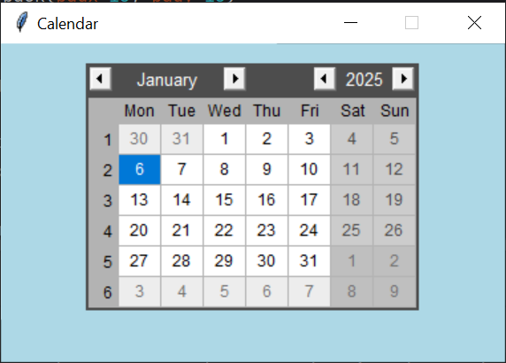
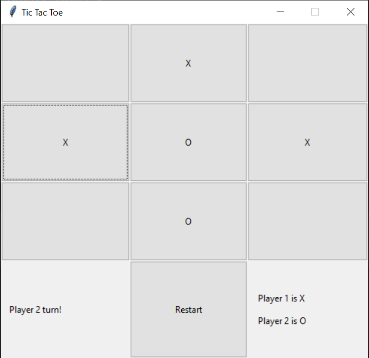
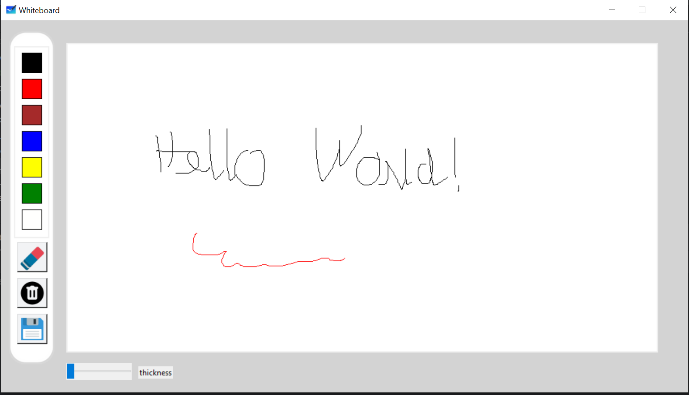
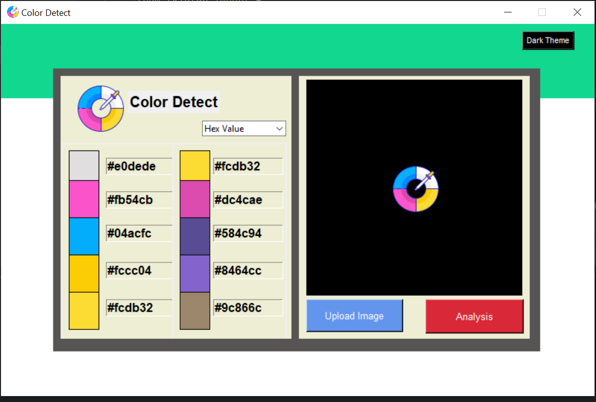

# Info Central App
## 💖 Donate
Xin chào bạn!

Cảm ơn bạn đã ghé thăm project của mình. Đây là những dòng code, những giờ học tập và làm việc không ngừng nghỉ để mình có thể hoàn thành các sản phẩm nhỏ bé này. Mình rất hy vọng chúng sẽ phần nào giúp ích cho bạn trong hành trình học tập hoặc làm việc.

Nếu bạn thấy project này hữu ích, hoặc đơn giản chỉ muốn ủng hộ một chút tinh thần cho mình, mình sẽ vô cùng biết ơn nếu bạn có thể mời mình một ly cà phê nhỏ qua link dưới đây:

👉 [Mời mình một ly cà phê](https://github.com/tmdkhac12/tmdkhac12/blob/main/DONATE.md) ☕

Những sự ủng hộ của bạn, dù lớn hay nhỏ, đều là động lực để mình tiếp tục phát triển, học hỏi, và chia sẻ thêm nhiều kiến thức hơn nữa đến cộng đồng. Một lần nữa, mình cảm ơn bạn rất nhiều!

Chúc bạn một ngày tuyệt vời! 🌟

## Mục lục
- [Giới thiệu](#giới-thiệu)
- [Tính năng chính](#tính-năng-chính)
- [Giao Diện Ứng Dụng](#giao-diện-ứng-dụng)
- [Yêu Cầu Hệ Thống](#yêu-cầu-hệ-thống)
- [Cấu trúc thư mục](#cấu-trúc-thư-mục)
- [Hướng dẫn cài đặt](#hướng-dẫn-cài-đặt)

## Giới thiệu
Ứng dụng Info Central được phát triển bằng Python sử dụng thư viện Tkinter.
Ứng dụng nhằm cung cấp thông tin chi tiết về máy tính, tích hợp nhiều tính năng tiện ích, bao gồm:

- Điều chỉnh độ sáng.
- Điều chỉnh âm lượng.
- Theo dõi thông tin pin.
- Mini app tích hợp: 
  - Weather App, Todolist, Color Picker, v.v.

Người dùng có thể tự do chọn và chạy từng mini app một cách độc lập.

## Tính năng chính của các Mini-apps
- **Weather App**: Ngươi dùng có thể tra cứu thông tin thời tiết ở các địa điểm trên thực tế.  
- **Todolist**: Lên kế hoạch các công việc cần làm
- **Calendar**: Xem lịch theo năm
- **Shutdown App**: Shutdown/Restart/Sleep thiết bị 
- **Tic Tac Toe**: Game Tic Tac Toe đơn giản cho 2 người chơi
- **Calculator**: Ứng dụng máy tính 
- **File Explorer**: Trình duyệt file
- **Google**: Mở công cụ tìm kiếm google 
- **White Board**: Bảng vẽ mở cho người dùng túy ý sáng tạo các ý tưởng
- **Color Picker**: Công cụ mạnh mẽ giúp lấy mã màu từ hình ảnh mà người dùng yêu cầu.

## Giao diện ứng dụng

### Main Interface:


### Weather App:


### Todolist:


### Calendar:


### Shutdown App:


### Tic Tac Toe:


### White Board:


### Color Picker:


## Yêu cầu hệ thống
- Python 3.7 hoặc cao hơn.
- Thư viện cần thiết:
  - tkinter

## Cấu trúc thư mục
```
info-central/
├── image/              # Chứa các files hình ảnh cần thiết của hệ thống
├── calendar_app.py     # Ứng dụng Calendar 
├── color_detect.py     # Ứng dụng Color Picker 
├── shutdown_app.py     # Ứng dụng Shutdown App 
├── tic_tac_toe.py      # Ứng dụng Tic Tac Toe  
├── to_do_list.py       # Ứng dụng Todolist  
├── listOfTasks.db      # Local database cho ứng dụng Todolist
├── weather_app.py      # Ứng dụng Weather App 
├── white_board.py      # Ứng dụng White Board  
├── lib.txt             # File các thư viện cần thiết cho hệ thống  
└── README.md
```  

## Hướng dẫn cài đặt

### 1. Cài đặt Python
Nếu máy tính của bạn đã có Python, có thể bỏ qua phần này và đến với phần tiếp theo, nếu chưa có thì [cài đặt Python](https://www.python.org/downloads/) theo hướng dẫn sau nhé.  

### 2. Cài đặt dự án 
Làm theo các bước sau để setup ứng dụng nhé:
1. Clone dự án.
```
git clone https://github.com/tmdkhac12/project-python-info-central-tkinter.git
```
2. Move vào thư mục dự án 
```
cd project-python-info-central-tkinter
```

3. Cài đặt các thư viện phụ thuộc 
```
pip install -r requirements.txt
```

### 3. Truy cập ứng dụng
1. Chạy ứng dụng:
```commandline
python main.py
```
2. Hoặc chạy từng mini app theo cách sau:
```commandline
python <app_name>.py
```
